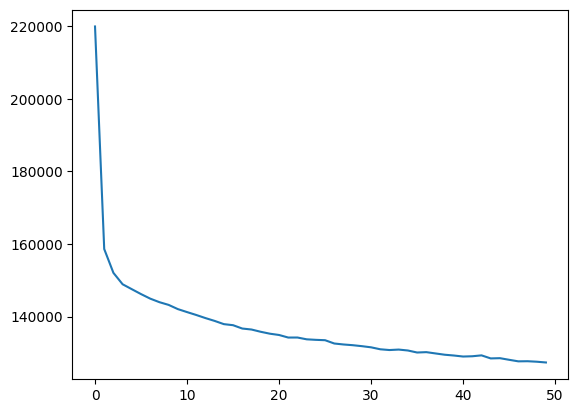

# Variational Auto Encoders (VAEs) for sequence space

The repo is used to decompose sequence space into a smaller dimension
representation (also called latent space) using a [Variational Auto
Encoder](https://en.wikipedia.org/wiki/Autoencoder#Variational_autoencoder_.28VAE.29).
The latent space is then used for further computation or for visualization.


### How to use this repository
1. Download this repository from git
   * ``` git clone https://github.com/RomeroLab/VAEs```
1. Put your Multiple Sequence Alignment (MSA) file in the sequence_sets directory
1. Switch to the conda `pytorch-docker` environment
   * ``` conda activate pytorch-docker ```
1. Edit the `config.yaml` file to have the correct paths and options. If you want to make a 2D sequences space plot then edit the `config2d.yaml` file instead. 
1. To run the model step by step run the following commands
   ```shell
        # run the reweighting script
        make reweighting 
        # run the model
        make runmodel 
   ```
   This will run the re-weighting step and then train the VAE model. 
   If you only want to make 2d sequence space plots then instead of the commands above run the single command
   ```shell
      make plotlatent
   ```
   This one command will run the model step by step and plot the 2d sequence space based on the `config2d.yaml` config file.

### Sanity check
Make sure that the loss function converges. It should look something like the image on the right. 



### Contributors

|  |   |
| --- | --- |
| **James Wang** | VAEs, CHTC scripts |
| **Juan Diaz** | VAEs, 1D-CNN VAEs, CHTC scripts, preprocessing scripts |
| **Sameer D'Costa** |  VAEs, DCA, CHTC scripts |

See the [contributor's page](https://github.com/RomeroLab/VAEs/graphs/contributors) for more details. 


### Acknowledgements / References
* The underlying VAE code has been taken from the [AE-VAE example](https://github.com/rasbt/deeplearning-models/blob/master/pytorch_ipynb/autoencoder/ae-var.ipynb) of Sebastian Raschka's [Deep Learning Models github archive](https://github.com/rasbt/deeplearning-models). 
* The method for re-weighting sequences has been taken from *Riesselman, Adam J., John B. Ingraham, and Debora S. Marks. "Deep generative models of genetic variation capture the effects of mutations." Nature methods 15.10 (2018): 816-822.*

# Direct Coupling Analysis (DCA)
DCA is a maximum entropy model (Hopfield Potts model) to estimate the
probability distribution of sequences in an MSA. We can set it up as a similar
network to VAEs with no hidden layers. The output layer is directly connected
to the input layer with an dense network with softmax activation. 


### Acknowledgements / References
* This pytorch implementation shall closely mimic sokrypton's [seqmodel
  implementation by Sergey Ovchinnikov](https://github.com/sokrypton/seqmodels/blob/master/seqmodels.ipynb)
* Ekeberg, Magnus, et al. "Improved contact prediction in proteins: using pseudolikelihoods to infer Potts models." Physical Review E 87.1 (2013): 012707.


# Overview of this repository

- [bin/](bin/) shell scripts that can be used from outside this repository
- [*.yaml](config.yaml) Example config files to run various types of models
- [images/](images/)
- [Makefile](Makefile) Easily run various types of models
- [run/](run/) 
  - scripts that are run from inside this repository
  - chtc submit scripts, 
- [sequence_sets/](sequence_sets/) Data files are stored here
- [source/](source/) 
  - Most python source files are for the various models. 
  - `\_tools.py` files are for the shell scripts in the [bin/](bin/) directory
working
