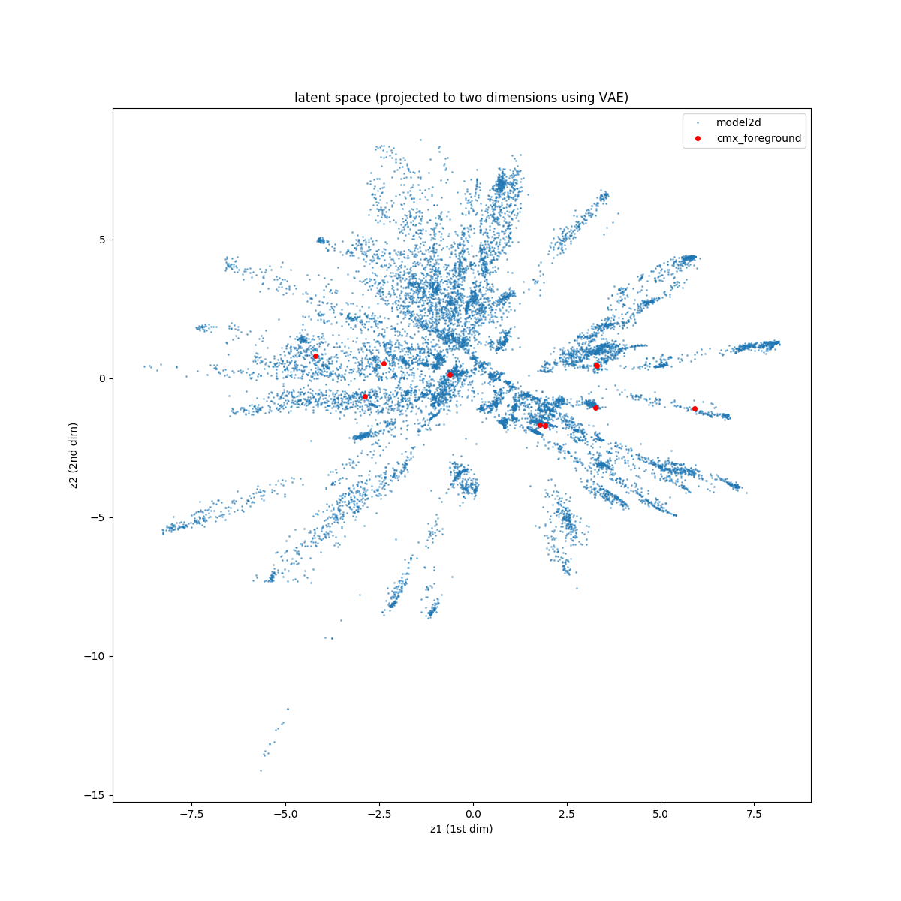

# Variational Auto Encoders (VAEs) for sequence space

The repo is used to decompose sequence space into a smaller dimension
representation (also called latent space) using a [Variational Auto
Encoder](https://en.wikipedia.org/wiki/Autoencoder#Variational_autoencoder_.28VAE.29).
The latent space is then used for further computation or for visualization.



### How to use this repository
1. Download this repository from git
   * ``` git clone https://github.com/RomeroLab/VAEs```
1. Put your Multiple Sequence Alignment (MSA) file in the sequence_sets directory
1. Switch to the conda `pytorch-docker` environment
   * ``` conda activate pytorch-docker ```
1. Edit the `config.yaml` file to have the correct paths and options
1. Use the makefile to run the scripts
   * ```shell
        # run the reweighting script
        make reweighting 
        # run the model
        make runmodel 
        # plot the latent space (must have 2d latent space for plots)
        make plotlatent
     ```

### Sanity check
Make sure that the loss function converges. It should look something like the image on the right. 


### Contributors
1. **James Wang** 
1. **Juan Diaz** 
1. **Sameer D'Costa** 

See the [contributor's page](https://github.com/RomeroLab/VAEs/graphs/contributors) for more details. 


### Acknowledgements
* The underlying VAE code has been taken from the [AE-VAE example](https://github.com/rasbt/deeplearning-models/blob/master/pytorch_ipynb/autoencoder/ae-var.ipynb) of Sebastian Raschka's [Deep Learning Models github archive](https://github.com/rasbt/deeplearning-models). 
* The method for re-weighting sequences has been taken from *Riesselman, Adam J., John B. Ingraham, and Debora S. Marks. "Deep generative models of genetic variation capture the effects of mutations." Nature methods 15.10 (2018): 816-822.*

